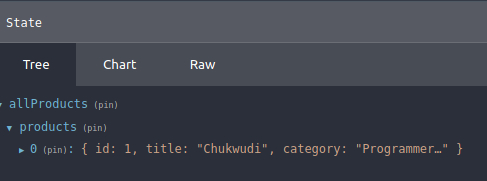

# Extra Practice
## Notice that we can create an actionTypes folder to hold all of our constants (the ones that refer to a specific action type).
- In our action creators we can import all of named constants and utilize them.
```
import * as types from '../actionTypes/action-types';
```
<hr />

## Creating our Action Creators (productActions.js)
- Recall that actions, should report things that happened, not MAKE things happen. An action is a plain JS object that explains what just happened.
- At the end of the day, **we are just following DRY principle**. It is much easier to call a function that returns an action to be dispatched rather than retype a specific action over and over again.
```
export const setProducts = (products) => ({
  type: types.SET_PRODUCTS,
  payload: products,
});

export const selectedProduct = (product) => ({
  type: types.SELECTED_PRODUCT,
  payload: product,
});
```

<hr />

## Creating our Reducers (productReducer.js)
- Recall that action, explains what just happened. Yet, an action alone does not change anything in the application state.
- Once an action is dispatched by the store (the store includes application state), the reducer (a pure JS function) will take in the inital state and an action.
- The reducer will then perform some computation and return a new state without mutating the original state.
```
const initialState = {};
export const productReducer = (state = initialState, action) => {

}
```
<hr />

## When you create an application, you are going to have many reducers. (index.js)
- We are going to combine our reducers inside of the index.js file of reducers.
```
import { combineReducers } from "redux";
import { productReducer } from "./productReducer";
```

- Then we can combine them with combineReducers.
```
const reducers = combineReducers({
    allProducts: productReducer
})
```

- Recall that combineReducers will **take in an object whose values are different reducing functions** and **returns a single reducing function.**
- This single reducing funnction can then be passed into createStore.
- **NOTE. The resulting reducer calls every child reducer and gathers their results into a single state object. Whatever the initialState is, that is what will be collected into the single state object.**
<hr />

## Creating the store.

```
import { createStore } from "redux";
import { reducer } from "./reducers/index";

const initialApplicationState = {};
const store = createStore(reducer, initialApplicationState);

export default store;
```

- Recall that a Redux store holds the complete state of your app. It is also a JS object.
- **NOTE: The only way to change the state in our store is to dispatch actions.**
- Our createStore function takes in a reducer, an optional preloadedState, and an enhancer (applyMiddleware()).

### Tips on Redux Store.
> Redux state is normally plain JS objects and arrays.

> If your state is a plain object, make sure you never mutate it! Immutable updates require making copies of each level of data, typically using the object spread operator ( return { ...state, ...newData } ).

> When a store is created, Redux dispatches a dummy action to your reducer to populate the store with the initial state. You are not meant to handle the dummy action directly. Just remember that your reducer should return some kind of initial state if the state given to it as the first argument is undefined, and you're all set.

> To apply multiple store enhancers, you may use compose().

<hr />

## Linking React Application with Redux
```
import React from 'react';
import ReactDOM from 'react-dom';
import App from './App';
+ import { Provider } from 'react-redux';
+ import store from './redux/store';

ReactDOM.render(
 + <Provider store={store}>
     <App />
 + </Provider>,
  document.getElementById('root')
);
```
- We utilize the Provider component to wrap our App. We pass Provider the store that we just created from the reducers.
- ### In Redux DevTools, we can see our state. We can see our initalState in devTools.
```
const initialState = {
    products: [{
        id: 1,
        title: "Chukwudi",
        category: "Programmer In Progress"
    }]
};
```

```
export const reducers = combineReducers({
    allProducts: productReducer
})
```
### Our DevTools will display allProducts, with the products array inside of it, followed by an object at index 0 with our id, title, and category.

### Recall that the resulting reducer from combineReducers will call every child reducer and gathers their results into a single state object. Whatever the initialState is, that is what will be collected into the single state object.
<hr />

## Creating React Components
